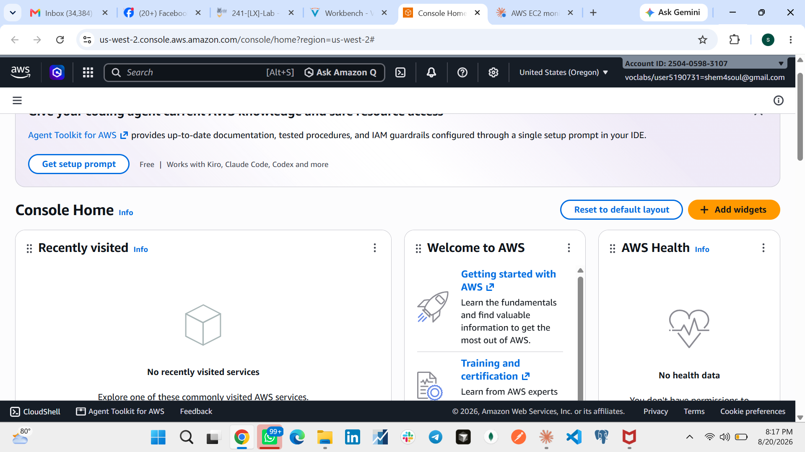
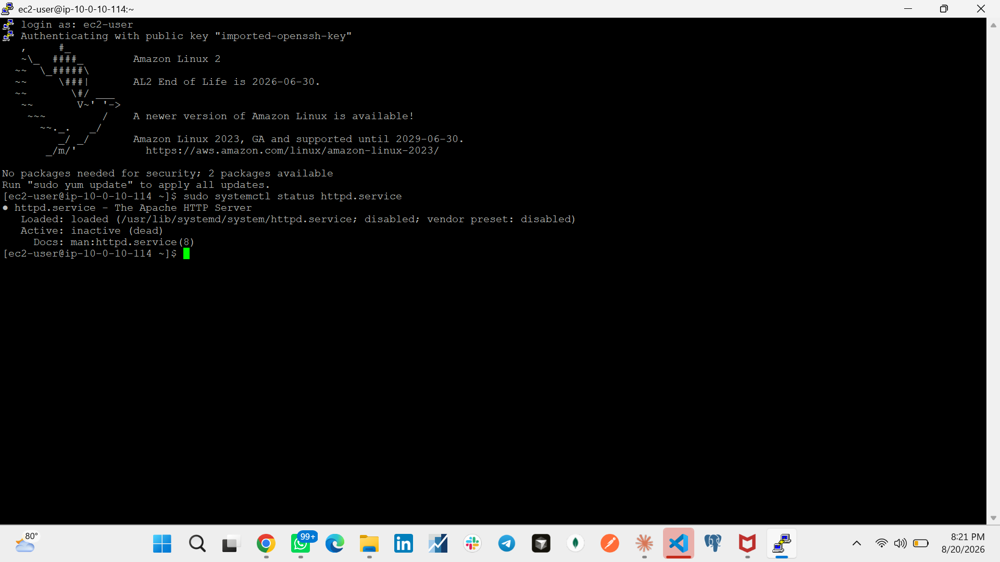
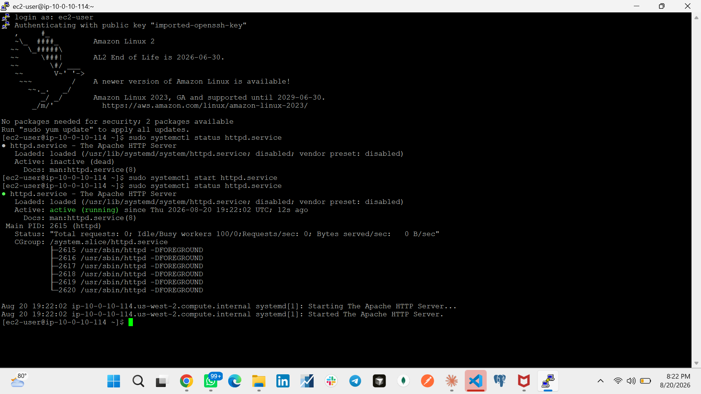
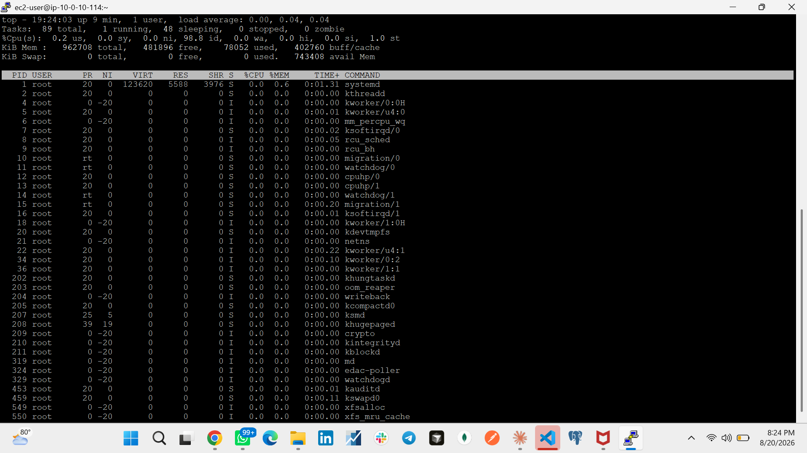
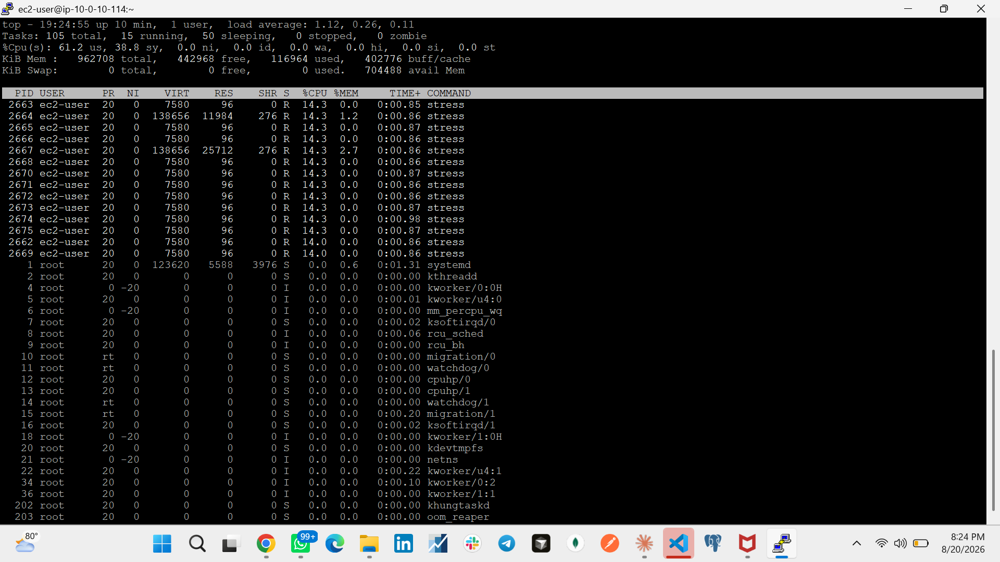
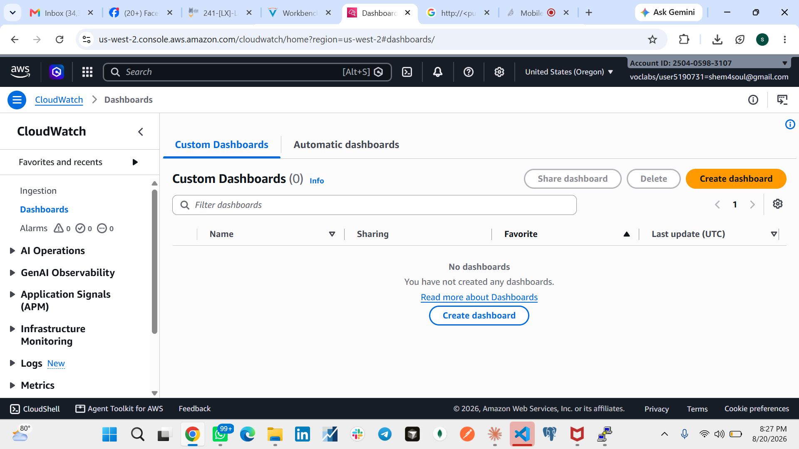
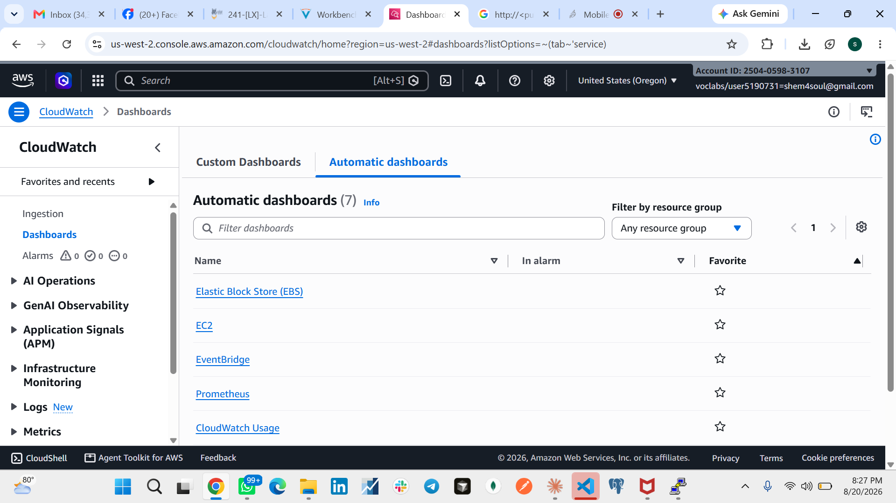
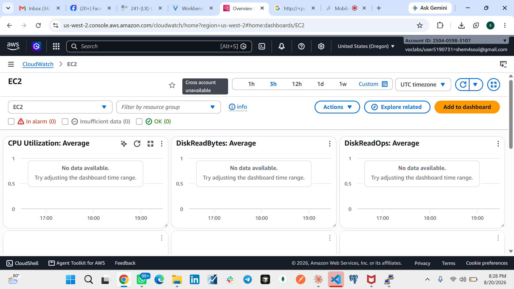
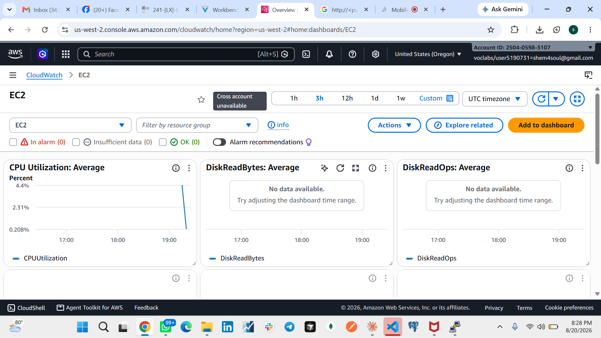
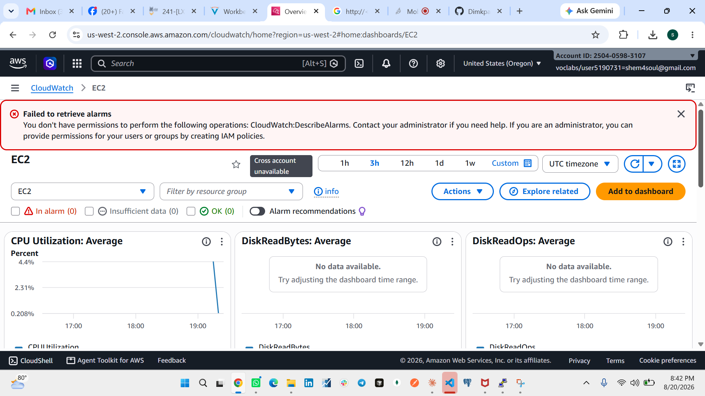

# Managing Services — Monitoring (AWS Lab Walkthrough)

A hands-on walkthrough of an AWS training lab covering **service management with `systemctl`** and **instance monitoring with `top` and Amazon CloudWatch** on an Amazon Linux 2 EC2 instance.

## Objectives

- Check the status of the `httpd` (Apache) service, start it, and verify it's reachable over HTTP
- Monitor an EC2 instance's resource usage locally using the Linux `top` command
- Monitor the same instance remotely using Amazon CloudWatch's automatic EC2 dashboard

**Duration:** ~30 minutes
**Environment:** Amazon Linux 2, `t3.micro` (1 vCPU, 1 GiB RAM), AWS CloudWatch (`us-west-2`)

---

## Walkthrough

### 1. AWS Console access
Logged into the AWS Management Console for the lab account.



### 2. Check `httpd` service status
Connected to the EC2 instance via SSH and checked the Apache service status — initially `inactive (dead)`, as expected for a freshly provisioned instance.

```bash
sudo systemctl status httpd.service
```



### 3. Start the `httpd` service
Started the service and confirmed it came up `active (running)` with worker processes spawned.

```bash
sudo systemctl start httpd.service
sudo systemctl status httpd.service
```



At this point, visiting `http://<public-ip>` in a browser shows the Apache HTTP Server test page, confirming the web server is reachable.

### 4. Baseline monitoring with `top`
Ran `top` before generating any load — CPU sits at ~98.8% idle.



### 5. Simulate CPU load and observe with `top`
Ran the lab's `stress.sh` script alongside `top` to simulate a heavy workload:

```bash
./stress.sh & top
```

CPU usage jumps to **61.2% user / 38.8% system**, with a dozen `stress` processes each consuming ~14% CPU.



### 6. CloudWatch — Custom Dashboards (empty)
Opened CloudWatch. No custom dashboards exist yet for this account.



### 7. CloudWatch — Automatic Dashboards
Switched to the **Automatic dashboards** tab, which AWS generates by default per service (EC2, EBS, EventBridge, Prometheus, etc.).



### 8. EC2 dashboard — before data catches up
Opened the auto-generated **EC2** dashboard. Metrics hadn't populated yet for the selected time range.



### 9. EC2 dashboard — CPU spike visible
After a short wait, the **CPU Utilization: Average** graph shows the spike that lines up with the `stress.sh` run. `DiskReadBytes`/`DiskReadOps` remain empty — expected, since the stress test only loads CPU, not disk I/O.



### 10. Note: restricted lab permissions
The lab environment intentionally scopes down IAM permissions. Attempting to view alarm status surfaces a `CloudWatch:DescribeAlarms` access-denied error — expected behavior in this sandbox, not a misconfiguration.



---

## Key takeaways

- `systemctl status/start/stop` is the standard way to manage `systemd`-based services (like `httpd`) on Amazon Linux 2.
- `top` gives real-time, local insight into CPU/memory usage and running processes — useful for quick diagnostics on the instance itself.
- CloudWatch's **automatic dashboards** provide zero-setup, per-service monitoring (EC2, EBS, etc.) without needing to build a custom dashboard.
- CloudWatch aggregates metrics on a delay (default 5-minute periods), so a load spike may take a few minutes to appear on the graph.
- Lab sandboxes often restrict IAM permissions to only what's needed for the exercise — permission errors outside the lab's scope (e.g., `DescribeAlarms`) are expected, not bugs.

## Repo structure

```
.
├── README.md
└── images/
    ├── 01-console-home.png
    ├── 02-httpd-status-inactive.png
    ├── 03-httpd-status-active.png
    ├── 04-top-baseline.png
    ├── 05-top-stress-load.png
    ├── 06-cloudwatch-custom-dashboards-empty.png
    ├── 07-cloudwatch-automatic-dashboards.png
    ├── 08-ec2-dashboard-no-data.png
    ├── 09-ec2-dashboard-cpu-spike.png
    └── 10-ec2-dashboard-alarm-permission-error.png
```

## Source

Based on an AWS Training and Certification lab exercise ("Managing Services - Monitoring"). © Amazon Web Services, Inc. and its affiliates — original lab content used for personal learning/documentation purposes only.
